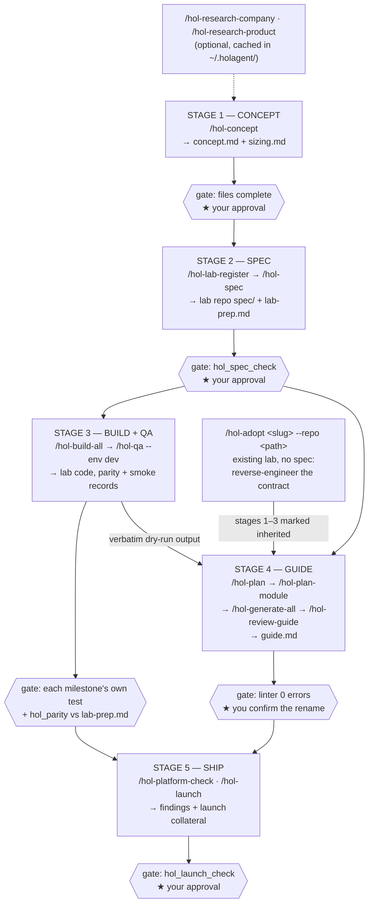
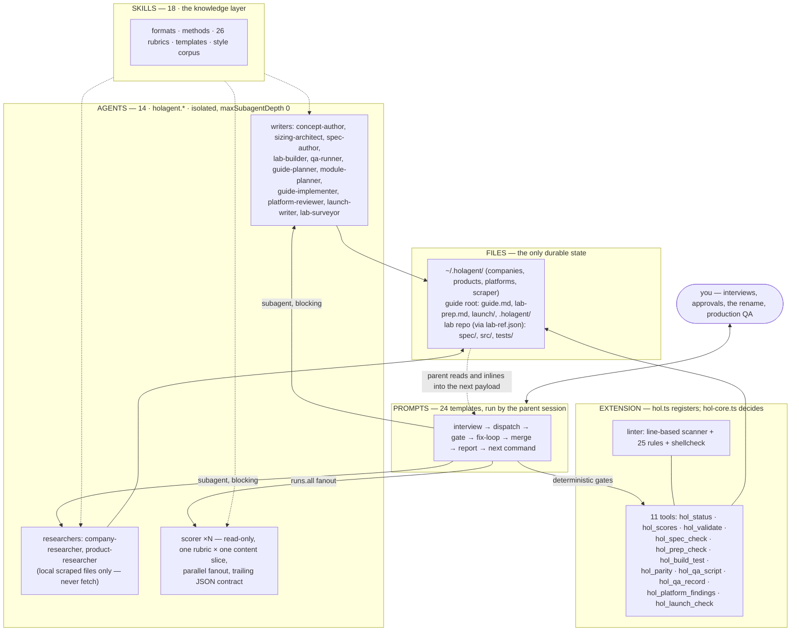

# holagent — project description

**Package:** `holagent-lab-guides` v0.2.0 · a Pi (pi.dev) agent package · UNLICENSED (internal team tool)
**Repo:** `~/projects/holagents` · 34 commits · tagged `v0.2.0` · zero runtime dependencies
**Date of this summary:** 2026-09-06

---

## 1. Executive summary

Building a Dell Hands-on Lab (HOL) is a nine-step job: brainstorm the solution and its
story, research and shrink the footprint, write a build spec, build the lab, write the
step-by-step guide, QA it, fit it to the vCD or Kubernetes platform team's rules, do a
final production QA, and then advertise it internally. Every step is manual, every step
depends on one person's memory of an unwritten house standard, and the four in-house
sample guides show the drift that results — broken TOC numbering, stale anchors,
`Module` vs `Phase` headings, credentials in the body that no longer match the
credentials block.

**holagent turns that nine-step job into an agent-driven pipeline with a deterministic
gate at every stage.** It interviews you into a demo story and a footprint, turns those
into a build spec and a *machine-readable environment contract*, builds the lab
milestone by milestone against that spec, verifies the running environment against the
contract, writes the guide module by module, reviews the lab against a platform team's
requirements, and produces the launch collateral. Nothing advances on an agent's
opinion: each stage ends at a deterministic check (exit codes, file structure,
cross-document agreement), a rubric scorecard, and **you**.

Two design commitments make it trustworthy rather than merely fast:

- **State lives in files, never in the conversation.** `/clear` freely between stages;
  every command re-detects where it is from disk and resumes. The whole state machine is
  reconstructable from `.holagent/`.
- **Determinism is never mediated by a model.** The linter, the state machine, the spec
  and contract checks, the milestone tests and the parity runs all live in unit-tested
  TypeScript that the model *calls* but cannot *interpret away* (ADR-007).

Version 0.1.0 automated step 5 of the nine (the guide). Version 0.2.0 extended it to
steps 1–3 and 6–9. What remains deliberately out of scope: provisioning the environment
itself, capturing screenshots, and publishing to the lab platform.

**Current maturity:** the automated battery is green — 124 unit/integration tests, 25
linter rules, corpus regression, package smoke test, one real guide (HOL-2000-01) taken
end-to-end through the v0.1.0 pipeline. The v0.2.0 lifecycle commands (stages 1–3 and 5)
are verified by tests and deterministic gates **but have not yet been run against a real
lab repo, a real dev environment, or a real platform team** — `docs/manual-e2e.md` says
so explicitly. That is the single biggest outstanding item.

---

## 2. Business use case

| | |
| --- | --- |
| **Who** | Solutions Architect at Dell, building HOL environments across Cyber Resilience, Storage, Networking, AI and Client |
| **Where labs run** | VMware Cloud Director (vCD) cloud or Kubernetes cloud, **many concurrent instances of each lab** |
| **Dominant constraint** | Efficiency — every environment must be shrunk to the smallest footprint that still demonstrates the solution convincingly to one user |
| **Volume** | ~5–20 guides/year, 3–9 modules each |
| **The pain** | Nine manual steps per lab; quality depends on the individual author; most existing labs have **no spec documents at all**; platform requirements are tribal knowledge held by the vCD/K8s teams |

The value is not only speed. It is (a) a house standard that is *executable* rather than
remembered, (b) a written environment contract that makes "the guide matches the lab" a
test instead of an opinion, and (c) a knowledge base for platform requirements that grows
after every meeting instead of evaporating.

---

## 3. What it does — the lifecycle

Five numbered stages (build and QA share stage 3), 24 slash commands, each ending at a
gate and waiting for you.

Note the shape: **an approved spec unblocks two independent tracks.** The build track and
the guide track run in parallel; they meet where QA's captured dry-run output becomes the
guide's verbatim expected results — so the guide can never claim an output nobody saw.

### Feature highlights

- **`/hol-adopt`** — the on-ramp that matters in practice. Most existing HOL environments
  have no spec, so adoption cannot start from one: `lab-surveyor` reverse-engineers
  `lab-prep.md` and an observed `sizing.md` from the repo's deployment artifacts and a
  read-only look at a running dev instance, you confirm it row by row, and stages 1–3 are
  recorded as *inherited* rather than fabricated (ADR-013).
- **`lab-prep.md` as a machine-readable contract** (ADR-011) — frontmatter declaring
  baseline, software+versions, credentials, endpoints, artifacts, and `verify` checks.
  `hol_parity` executes those checks against dev; `hol_launch_check` and the linter hold
  the guide, the plan and the collateral to the same facts.
- **Dev-only execution boundary** (ADR-012) — `hol_parity` refuses any non-dev
  environment, with no override flag. Production QA is *rendered as a read-only script*
  for a human to run; the tool records what you report and executes nothing.
- **Milestones declare their own test** (ADR-015) — a build milestone reaches `tested`
  only when its own declared command passes, and passing rubric scores never outrank a
  red test.
- **Platform-requirements knowledge base** (ADR-014) — `/hol-platform-init` interviews a
  platform team across ten categories; `/hol-platform-check` reviews a lab against *that
  file only*, produces severity-tagged findings plus a pre-meeting brief (what we don't
  comply with, what we need from them, what they'll ask), then appends whatever new rule
  the meeting surfaced.
- **Claim tracing in the launch collateral** (ADR-017) — every sentence in the exec
  summary, catalogue entry and social posts must trace to the guide, plan, sizing or
  concept, and the catalogue's ID/title/duration are checked against `plan.md`.
- **25-rule deterministic linter** with optional `shellcheck` on inline commands, driven
  by `format.json` — one source of truth shared by the linter, CI and the LLM-facing
  format skill.
- **Two LLM-bypass commands** — `/hol-validate` and `/hol-status` run the same core with
  no model in the path.

---

## 4. Architecture

**Division of labour: prompts orchestrate, subagents work, skills carry knowledge, the
extension carries determinism.**

**Key architectural decisions** (18 ADRs, indexed in `docs/adr/README.md`):

- **No agent-to-agent handoff exists.** All 14 agents run with
  `maxSubagentDepth: 0`, `inheritProjectContext: false`, `inheritSkills: false`. The
  parent session is the only integration point; the durable handoff medium is the
  filesystem (ADR-001).
- **Knowledge lives inside skill directories** (ADR-002) — the only
  install-location-independent path mechanism Pi offers.
- **Line-based linter, no Markdown AST, no build step** (ADR-004) — erasable TypeScript
  under Node 22's `--experimental-strip-types`, hand-written mini-YAML frontmatter
  parser, zero runtime dependencies.
- **`guide.md` is canonical until the end** (ADR-005) — the rename to
  `<ID>-<Title>.md` happens only after an all-passing scorecard, 0 lint errors, and your
  explicit confirmation.
- **Scorer output is exactly one trailing fenced JSON block** (ADR-006) — the parent
  extracts, validates the shape, *recomputes* the score from the criterion scores, retries
  once, then escalates. The system never guesses a score.
- **Write confinement** — the package writes only under `~/.holagent/` and the active
  guide root. A lab's own repo is reachable only through `lab-ref.json`, registered once
  with explicit confirmation (ADR-008).

**Quality machinery.** Two independent tiers. *Deterministic gates* decide what can be
decided — format, completeness, cross-document agreement, exit codes. *Scorers* judge
what cannot — 26 rubrics across 10 scopes in three families (checklist must be 1.0;
analytic and holistic must average ≥ 4). Failing entries drive a capped fix loop:
analytic/holistic cap at 3 rounds, checklist escalates at 5 or earlier if two consecutive
rounds don't improve. Anything that hits its cap is recorded `escalated` and surfaced to
you rather than silently accepted.

**Scale:** ~5,600 lines of extension/linter TypeScript, ~4,100 lines of tests, 124 test
cases across 16 files, corpus regression baselines over the four in-house sample guides.

---

## 5. Where it could be improved or expanded

**Close the live gates first — everything below is second.** The v0.2.0 lifecycle is
verified by tests and deterministic gates only. The highest-value single run is
`/hol-adopt sign-tutor --repo ~/projects/sign-tutor`, then hand-checking every inferred
version and path against `SOFTWARE_INVENTORY.md` and `docker-compose.yml` — that is where
reverse-engineering accuracy actually gets judged. Then: a deliberately broken
`lab-prep.md` entry to prove `hol_parity` flags it, and a planted unverifiable claim to
prove `claim-traceability` catches it. Until those run, treat stages 1–3 and 5 as
unexercised against real infrastructure.

**Near-term, high value**

1. **The screenshot loop is now the biggest manual step.** Guides emit
   `<< INSERT SCREENSHOT: … >>` placeholders that a human fills by hand. A capture agent
   driving a headless browser against the dev environment — one capture per image-checklist
   item, named by module — would close the last big gap in stage 4, and the module plan
   already specifies exactly what each shot should show.
2. **Share the knowledge base.** `~/.holagent/` is per-machine. Company profiles, product
   profiles and especially `platforms/<name>/requirements.md` are the team's compounding
   asset — tribal knowledge that took meetings to acquire. Backing that directory with a
   git repo (or making it a registered second data root) would let the whole team's
   platform reviews improve together instead of once per laptop.
3. **Cost and model tiering.** Scorer fanout is the token hot spot: 26 rubrics, several
   per scope, re-run each fix-loop round. Pinning `holagent.scorer` to a cheaper model
   (already supported via agent frontmatter or `subagentOverrides`) and recording
   tokens/wall-clock per stage into `scores.json` would both cut spend and produce the
   ROI numbers that justify the tool internally.
4. **Guide-rot detection.** `hol_parity` is currently a stage-3 event. Running it on a
   schedule against dev — and diffing `lab-prep.md` against what the environment actually
   reports — would catch the classic failure where the lab moves and the guide silently
   stops being true.

**Larger expansions**

5. **Stage 0 — provisioning.** The declared non-goal is the obvious next stage:
   `sizing.md` already contains the honest production footprint, the minimal demo
   footprint and the density maths. Generating the vCD template or Helm/Compose manifests
   from it — and feeding the platform team's own requirements file into that generation —
   would make the footprint claim executable rather than documented.
6. **Stage 6 — publishing.** Upload to the HOL catalogue is still hand-work.
   `catalogue-description.md` is already frontmatter-checked against `plan.md`; the last
   mile is an API call, gated by your approval like every other outward-facing step.
7. **Portfolio view.** `hol_status` reports one lab. A cross-lab roll-up — which of the
   ~20 labs are drifting, unreviewed by a platform team, or built on a superseded product
   version — is the natural management artifact, and all the state to build it is already
   on disk.
8. **Feed real usage back into the rubrics.** Learner feedback and the questions that
   actually get asked in a delivered lab are the ground truth the rubrics are proxying
   for. A loop from delivered-lab feedback into `evaluation/rubrics/` would keep the
   standard honest.

**Housekeeping**

9. `spec/` and `docs/lifecycle-plan.md` are both marked historical but are still the
   longest documents in the repo; `README.md` describes six stages while
   `docs/quickstart.md` numbers five (QA is folded into stage 3). Worth reconciling before
   the next person reads them.
10. The one real end-to-end artifact (HOL-2000-01) predates the lifecycle work and its
    guide has since moved out of this repo by convention. A single current lab carried
    through all five stages would double as the regression fixture and the demo.
