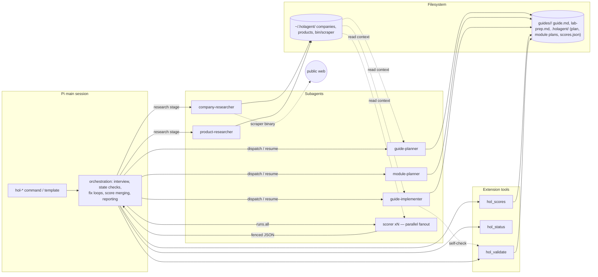

# 02 — Architecture

## 1. Components and responsibilities

holagent is a pi package with four component kinds plus one executable library.
Division of labor: **prompts orchestrate, subagents work, skills carry knowledge,
the extension carries determinism**.

| Component | Count | Runs in | Responsibility |
|---|---|---|---|
| Prompt templates (`prompts/*.md`) | 10 | Main session | User entry points. Parse args, check state (via `hol_status`), dispatch subagents, run fix loops, present results, suggest next command |
| Subagents (`agents/*.md`) | 6 | Child sessions (pi-subagents) | Focused workers: planning, module authoring, research, scoring |
| Skills (`skills/*/SKILL.md`) | 13 | On demand (main or child) | Procedural + domain knowledge: format spec, rubrics, style corpus, research workflows, templates |
| Extension (`extensions/hol.ts`) | 1 module | Pi runtime | 3 tools + 2 commands: deterministic lint, state detection, atomic score persistence |
| Linter (`extensions/linter/`) | library + CLI | Node (called by extension, CI, tests) | The executable format spec: line-based Markdown checks + shellcheck on extracted commands |

### 1.1 Prompt templates (10)

| Command | Arg | What it does |
|---|---|---|
| `/hol-plan` | `[topic]` | Interview (ID, audience, objectives, environment) → `guide-planner` → scoring fanout (plan rubrics) → approval loop → `plan.md` + `lab-prep.md` |
| `/hol-plan-module` | `<module>` | `module-planner` → module plan file → light scoring (module-plan rubrics) |
| `/hol-generate-module` | `<module>` | `guide-implementer` writes the module section → linter loop → scoring fanout (module rubrics) → fix loop via resume (capped) → merge scores |
| `/hol-generate-all` | `[--fresh]` | Detect state, resume in module order; runs the per-module pipeline sequentially; checkpoint report after each module |
| `/hol-research-company` | `[url:<u> slug:<s>]` | Scrape via `scrape-website` skill + scraper binary → `company-researcher` → `company.md` + `style-guide.md` in `~/.holagent/companies/<slug>/` |
| `/hol-research-product` | `<product> [company:<slug>]` | Product research (product profile docs + company context) → `product-researcher` → `product.md` in `~/.holagent/products/<company>/<product>/` |
| `/hol-review-plan` | — | Scorer fanout over plan rubrics → merge → scorecard |
| `/hol-review-module-plan` | `<module>` | Scorer fanout over module-plan rubrics → merge → scorecard |
| `/hol-review-module` | `<module>` | Scorer fanout over module rubrics (single module) → merge → scorecard |
| `/hol-review-guide` | — | Scorer fanout over guide-wide rubrics → merge → scorecard; on pass, offers final rename `guide.md → <ID>-<Title>.md` (user confirms) |

`<module>` accepts `NN` (e.g. `2`), `NN-slug` (e.g. `02-upload-documents`), or an
unambiguous title fragment; the template resolves it against `plan.md` and lists
available modules on ambiguity.

### 1.2 Subagents (6)

Runtime names use the package scope `holagent` (frontmatter `package: holagent`):

| Agent | Tools (strict allowlist) | Skills injected | Notes |
|---|---|---|---|
| `holagent.guide-planner` | read, write, edit, bash, grep, find, ls | guide-format, guide-scaffolds, evaluation, design-modules, load-context, lab-anti-patterns, style-corpus | Drafts plan + `lab-prep.md`; does **not** interview (parent relays); writes files; returns draft + open questions |
| `holagent.module-planner` | read, write, edit, bash, grep, find, ls | guide-format, guide-scaffolds, evaluation, design-modules, load-context | Writes `.holagent/<NN-slug>/plan.md` incl. image checklist |
| `holagent.guide-implementer` | read, write, edit, bash, grep, find, ls | guide-format, write-guides, match-writing-style, load-context, style-corpus, lab-anti-patterns | Authors one module section; runs `hol_validate` itself for a self-check; never rewrites other modules |
| `holagent.company-researcher` | read, write, edit, bash, grep, find, ls | research-company, analyze-writing-style, load-context | Analyzes scraped files only (never fetches) |
| `holagent.product-researcher` | read, write, edit, bash, grep, find, ls | research-product, load-context | Same |
| `holagent.scorer` | read, grep, find, ls | evaluation (rubric content is inlined in the task anyway) | Read-only, no bash. One scorer = one rubric × one content slice. Output contract: fenced JSON (§Interfaces) |

Design note (deliberate deviation from the reference plugin): the reference plugin's
review agents dispatched their own scorer subagents (grandchildren). pi-subagents
policy keeps orchestration in the parent session, so **review commands are pure
prompt templates** that fan out `holagent.scorer` directly via `workflowScript`
`runs.all`. This removes one agent layer and makes fanout parallel with stable keys.

### 1.3 Skills (13)

| Skill | Origin | Purpose |
|---|---|---|
| `load-context` | rewritten | Path conventions (`~/.holagent`, `guides/<slug>/.holagent`), two-phase discovery (cheap `ls` first), per-command context matrix |
| `scrape-website` | ported + `cli.md` | Scraper binary usage; bootstrap to `~/.holagent/bin/scraper` (pinned version + SHA-256); sitemap/llms.txt flow |
| `research-company` | ported | Company scrape workflow (primary domain, external-domain confirmation, docs sites) |
| `research-product` | ported | Product profile workflow |
| `analyze-writing-style` | ported | Distill style guide from corpus |
| `match-writing-style` | ported | Apply style guide to authored content |
| `guide-format` | **new** | The house format standard in prose (single source for LLMs); carries `format.json` — machine-readable rule config consumed by the linter |
| `evaluation` | rewritten | `scoring-guide.md`, `scorer-prompts.md` (task templates), rubrics under `checklist/`, `analytic/`, `holistic/` for scopes: plan, module-plan, module, guide |
| `style-corpus` | **new** | The four sample guides (committed copies) + guidance on using them as the style reference |
| `lab-anti-patterns` | rewritten | Lab-guide-specific anti-patterns (drift classes + authoring traps; replaces the reference plugin's script anti-patterns) |
| `design-modules` | ported (design-challenges) | Learning arc, pacing, checkpoint placement, module design guidance |
| `write-guides` | ported (write-content) | Prose conventions: steps, bolded UI actions, command blocks, expected-result wording |
| `guide-scaffolds` | **new** | Templates: `guide-plan.md`, `module-plan.md`, `lab-prep.md`, `company.md`, `product.md`, `style-guide.md`, `guide-scaffold.md` |

Why knowledge lives inside skill dirs (not a loose `references/` tree): pi resolves
relative paths in a SKILL.md against the skill directory, and a package's install path
varies (npm vs git). Skill-bundled files are the only install-location-independent
mechanism. (ADR-002.)

### 1.4 Extension (single module `extensions/hol.ts`)

Registers:

- Tool **`hol_validate`** — runs the linter on a guide; read-only (invokes
  `shellcheck` via `execFile` when available).
- Tool **`hol_status`** — deterministic state detection (§Interfaces).
- Tool **`hol_scores`** — atomic read/merge of `.holagent/scores.json`
  (write to temp file + `rename()`; single-writer: only the parent session calls it).
- Command **`/hol-validate [guideDir]`** — runs the linter, writes
  `.holagent/last-validation.json`, reports via `ctx.ui.notify` + a `ctx.ui.setWidget`
  findings table. (Extension commands are checked before template expansion, so no
  prompt template shares these names.)
- Command **`/hol-status [guideDir]`** — renders the state table.

No event handlers in v1 (keeps the attack/surface area minimal; ADR in
`06-documentation-plan.md`).

### 1.5 Linter (`extensions/linter/`)

- `format.json` (in `skills/guide-format/`) = machine-readable rule config: rule IDs,
  severities, required-block headings, regexes, the exact platform-notice string.
  Linter and CI read the same file → one source of truth for rule *configuration*.
  Rule *logic* lives in TS (`rules/*.ts`, one file per rule group); a test asserts
  every rule ID in `format.json` has a registered implementation and a documented
  section in `guide-format/SKILL.md`.
- Line-based scanner (no Markdown AST dependency — ADR-004): collects headings, TOC
  items, links, images, callouts, command candidates with line numbers.
- CLI: `node --experimental-strip-types extensions/linter/cli.ts <guideDir>` → JSON
  report on stdout, exit codes: `0` clean (warnings allowed), `1` errors, `2`
  warnings-only, `3` usage/config error.
- Written in **erasable TypeScript only** (no enums, no parameter properties, no
  namespaces) so it runs under Node's type stripping without a build step.

## 2. Data flow



Stage separation: each stage reads only the files previous stages produced (plans,
profiles), so the user may `/clear` between stages without losing state. All
cross-stage knowledge is in files, never in conversation history.

## 3. Data model

### 3.1 File layout

```
~/.holagent/                          # research cache (HOLAGENT_DATA_DIR overrides)
├── companies/<company-slug>/
│   ├── company.md                    # mission, products, terminology, branding
│   ├── style-guide.md                # tone, voice, term substitutions, callout usage
│   ├── manifest.json                 # scraper metadata: domains, external_urls, urls[]
│   └── website/                      # scraped pages (markdown), sitemaps/
├── products/<company-slug>/<product-slug>/
│   ├── product.md                    # capabilities, architecture, concepts, gotchas
│   ├── manifest.json
│   └── website/
└── bin/scraper                       # pinned scraper binary + scraper/manifest.json (version, sha256)

guides/<slug>/                        # one guide
├── guide.md                          # canonical working file (final: <ID>-<Title>.md after user-confirmed rename)
├── lab-prep.md                       # environment manifest for builders
└── .holagent/
    ├── plan.md                       # guide plan (YAML frontmatter + sections)
    ├── <NN-slug>/plan.md             # per-module plan (frontmatter + sections)
    ├── scores.json                   # scoring checkpoints (atomic writes)
    └── last-validation.json          # latest linter report
```

Write confinement: the package writes only under `~/.holagent/` (or
`$HOLAGENT_DATA_DIR`) and the active guide dir. Enforced in the extension (path
validation) and in skill/agent instructions.

### 3.2 Entities

| Entity | Location | Key fields |
|---|---|---|
| CompanyProfile | `~/.holagent/companies/<slug>/company.md` | name (exact case), industry, mission, products[], terminology map, brand notes |
| StyleGuide | `style-guide.md` | tone, formality, sentence patterns, term substitutions, callout conventions, sample excerpts |
| ProductProfile | `~/.holagent/products/<co>/<prod>/product.md` | summary, capabilities[], architecture, key concepts, common pitfalls, doc sources[] |
| GuidePlan | `guides/<slug>/.holagent/plan.md` | see §3.3 |
| ModulePlan | `.holagent/<NN-slug>/plan.md` | see §3.4 |
| LabPrep | `guides/<slug>/lab-prep.md` | env baseline, pods/containers, pre-loaded paths, credentials, ports/URLs, timing notes, cleanup |
| GuideFile | `guides/<slug>/guide.md` | the deliverable (§3.5 format) |
| ValidationReport | `.holagent/last-validation.json` | see §Interfaces |
| ScoreEntry | `.holagent/scores.json` | see §Interfaces |

### 3.3 Guide plan (`plan.md` frontmatter — machine-readable source of truth)

```yaml
---
id: HOL-1345-01                 # ^HOL-\d{4}-\d{2}$, prompted at /hol-plan
title: "NVIDIA Enterprise RAG 2.3 Blueprint"
slug: nvidia-enterprise-rag-2-3
audience:
  - Dell field technical specialists
  - AI solution architects
prerequisites:
  - Knowledge of NVIDIA Enterprise AI Suite
duration_minutes: 60
objectives:                     # 3-5, action-verb led
  - Configure a RAG collection with a custom metadata schema
  - Ingest documents and verify retrieval quality
environment:
  baseline: "Dev sandbox container, Ubuntu 22.04"
  credentials:
    - "FQDN: ubuntu-22-04.demo.local — IP: 192.168.1.100 — demouser / Password123!"
  urls: ["https://localhost:8090"]
  preloaded: ["/mnt/cache/RAG_Files/Manufacturing/"]
modules:                        # ordered
  - { n: 1, slug: create-collections, title: "Create Collections", goal: "…", est_minutes: 10 }
  - { n: 2, slug: upload-documents, title: "Upload Documents & Input Metadata", goal: "…", est_minutes: 15 }
---
# Guide Plan: <title>           # narrative sections follow:
## Why this guide / learning arc
## Module roadmap (per module: narrative, depends-on, teaching points)
## Environment & lab prep summary (points at lab-prep.md)
## Open questions / assumptions
```

### 3.4 Module plan (`.holagent/<NN-slug>/plan.md`)

```yaml
---
module_n: 2
slug: upload-documents
title: "Upload Documents & Input Metadata"
depends_on: [1]
est_minutes: 15
image_checklist:                # every screenshot the module needs
  - "RAG UI → New Collection button"
  - "Collection created in list view"
success_criteria:
  - "Collection 'Manufacturing' exists with Document_Type metadata field"
---
## Step outline (numbered; each step: action, expected result, screenshot?)
## Environment delta (what this module assumes is already true)
## Commands used (full command text, in backtick form)
## Expected outputs (verbatim sample output where known)
```

### 3.5 Guide format (generated `guide.md`)

Standard structure (the linter enforces this; `guide-format` skill documents it):

1. `# <ID> <Title>` (H1, line 1)
2. `ℹ️ You can resize or hide the lab guide anytime by sliding it left or right.` (within first 3 non-empty lines)
3. `## Table of Contents` — numbered `1..N`, every entry `[n. Title](#anchor)`, anchors must resolve
4. `### Lab Credentials:` — at least one credential line
5. `### Target Audience`
6. Prerequisites (any heading level under Introduction or standalone)
7. `## Introduction` — must contain `**Duration:**` and `**Objective:**` (bullets)
8. `## Module 1: …` … `## Module N: …` (sequential; body: numbered steps, bolded UI
   actions, tab-indented backticked commands, `> ✅ **Checkpoint:**`, callouts
   `**Tip:**` / `**Note:**` / `⚠️ **Important:**` / `**Use Case:**`, images)
9. `## Summary` (after last module)
10. Optional `## Appendix I: …` (after Summary)
11. Every `##` section ends `[Back to top](#table-of-contents)` (followed by `***`)

### 3.6 State machine

Per-module derived state (computed by `hol_status` from files + scores):

```
unplanned → planned → generated → validated → scored-passed
                │          │           │                │
                └──────────┴───────────┴── scored-escalated (loop back via
                                           /hol-generate-module or manual fix)
```

- `planned`: module plan file exists.
- `generated`: `guide.md` contains `## Module <n>:`.
- `validated`: latest linter run (this module's sections) has 0 errors.
- `scored-passed` / `scored-escalated`: per `scores.json` entry status.

Guide level: `research? → planned → modules(in progress) → reviewed`. `/hol-generate-all`
resumes at the first module not in `scored-passed`, re-validates existing modules
first, and stops with a report on any module it cannot complete.

## 4. Key interfaces / API contracts

### 4.1 Extension tool: `hol_validate`

```jsonc
// input
{ "guideDir": "guides/nvidia-enterprise-rag-2-3" }   // optional; default = resolveGuideRoot(cwd)
// output (details)
{
  "ok": false,
  "guideDir": "/abs/path",
  "findings": [
    { "rule": "L004", "severity": "error", "line": 7, "message": "TOC anchor #phase-1-create-collections does not resolve" }
  ],
  "shellcheck": [ { "rule": "L014", "severity": "error", "line": 88, "command": "kubectl get pod", "message": "SC2148: ...; use a quoted variable or run shellcheck" } ],
  "summary": { "errors": 4, "warnings": 2 },
  "reportFile": ".holagent/last-validation.json"
}
```

Errors: `E-PATH` (no guide root resolvable — cwd has no `guide.md` and no arg),
`E-READ` (unreadable file). A missing `shellcheck` binary is not an error:
`shellcheck: "skipped (shellcheck not installed)"` plus warning `W-SH`.

`resolveGuideRoot(cwd)`: nearest ancestor (up to 3 levels) containing both
`guide.md` and `.holagent/`; else the arg must be an explicit guide dir; else error.

### 4.2 Extension tool: `hol_status`

```jsonc
// input
{ "guideDir": "…" }                      // optional
// output
{
  "guide": { "slug": "nvidia-enterprise-rag-2-3", "id": "HOL-1345-01", "title": "…", "file": "guide.md" },
  "research": { "companies": ["dell"], "products": ["dell/nvidia-enterprise-rag"] },
  "plan": { "exists": true, "moduleCount": 5, "objectives": 4 },
  "modules": [
    { "n": 1, "slug": "create-collections", "state": "scored-passed",
      "scores": { "checklist": 1.0, "analyticMean": 4.3 } }
  ],
  "lastValidation": { "ok": true, "errors": 0, "warnings": 2, "at": "2025-01-01T00:00:00Z" },
  "next": "/hol-generate-module 04-manage-state"
}
```

### 4.3 Extension tool: `hol_scores`

```jsonc
// input
{
  "guideDir": "…",
  "action": "read" | "merge",
  "entries": [                            // required when action=merge
    {
      "scope": "module-02-upload-documents",   // "plan" | "module-plan-<NN>" | "module-<NN-slug>" | "guide"
      "rubric": "analytic/step-clarity",
      "kind": "checklist" | "analytic" | "holistic",
      "status": "passed" | "failed" | "escalated",
      "score": 4,                          // checklist: pass rate 0-1 (e.g. 0.86)
      "rounds": 2,
      "findings": [ { "criterion": "…", "score": 3, "finding": "…" } ],
      "updated_at": "2025-01-01T00:00:00Z"
    }
  ]
}
// output
{ "ok": true, "scoresPath": "…", "merged": ["module-02-upload-documents/analytic/step-clarity"] }
```

`merge` is atomic: validate all entries first, write temp file in the same
directory, `rename()`. Never partial.

### 4.4 Scorer output contract (LLM → parent)

Each scorer child must end its reply with exactly one fenced JSON block, no prose
after it:

```json
{
  "rubric": "analytic/step-clarity",
  "scope": "module-02-upload-documents",
  "kind": "analytic",
  "criteria": {
    "actionable-steps": { "score": 4, "criterion_text": "<verbatim criterion text>", "finding": null },
    "expected-outputs": { "score": 3, "criterion_text": "…", "finding": "Step 3 has no expected output (guide.md L88)" }
  }
}
```

Rules: `score` ∈ 1–5 (analytic/holistic) or 0–1 (checklist); `criterion_text` copied
verbatim from the rubric; `finding` is `null` when the criterion passes, otherwise
references a concrete location. The parent extracts the last fenced JSON block per
child; if parsing fails, the parent re-runs that single scorer once (max 1 retry).
(ADR-006: no reliance on per-item `outputSchema` in `workflowScript` items.)

Scorer fanout pattern (embedded in the review/generate prompts and
`skills/evaluation/scorer-prompts.md`):

```js
// one async workflowScript per scoring phase; stable keys = rubric names
const results = await runs.all([
  { key: "score-step-clarity",       agent: "holagent.scorer", task: "<task payload A>" },
  { key: "score-technical-accuracy", agent: "holagent.scorer", task: "<task payload B>" }
]);
return results; // parent parses each result.output's trailing JSON block
```

Task payload = scoring guide (full text) + rubric file content + content slice
(file/section, inlined) + scope label + the contract above. Every scorer gets the
identical scoring guide so calibration is consistent.

### 4.5 Linter rules (v1 set)

`E` = error (blocks), `W` = warning (advisory). Config (headings, regexes, the
exact platform-notice string) comes from `skills/guide-format/format.json`.

| ID | Sev | Check |
|---|---|---|
| L001 | E | H1 present as first non-empty line: `# <ID> <Title>` with `ID` matching `^HOL-\d{4}-\d{2}$` |
| L002 | E | Platform notice `ℹ️ You can resize or hide the lab guide anytime by sliding it left or right.` verbatim within first 3 non-empty lines |
| L003 | E | `## Table of Contents` exists before first module; TOC display numbers sequential `1..N` |
| L004 | E | Every TOC anchor resolves to an existing heading (GitHub anchor algorithm, §4.6); anchors must be local (`#…`) |
| L005 | E | TOC coverage: every `##` section (except Table of Contents) appears exactly once in the TOC |
| L006 | E | `### Lab Credentials:` (h3) before Introduction; ≥1 credential line |
| L007 | E | `### Target Audience` present |
| L008 | E | `## Introduction` present (variants like "Introduction Overview"/"Orientation" → error with rename hint) |
| L009 | E | Introduction contains `**Duration:**` and `**Objective:**` |
| L010 | E | `## Summary` present after the last module (appendices may follow) |
| L011 | E | Body sections match `## Module <N>: <Title>`, N sequential from 1; `## Phase …` rejected with hint |
| L012 | E | Every `##` section ends with `[Back to top](#table-of-contents)` |
| L013 | E | Every image line is either `{data-modal=true}` or `<< INSERT SCREENSHOT: <desc> >>` |
| L014 | E | Extracted inline command fails `shellcheck` (parse errors = E; style = W014). Extraction heuristic §4.7. Skipped + `W-SH` if binary missing |
| W001 | W | Mixed/non-standard callout variants (e.g. `**Tip!**`, `**Use Case!` alongside standard forms) |
| W002 | W | `##` section > 400 lines with no `###` subheading (pacing) |
| W003 | W | `## Summary` appears before all modules (ordering drift) |
| W004 | W | Module with ≥3 command steps and no `> ✅ **Checkpoint:**` |
| W005 | W | Image checklist (module plan) vs actual placeholders/links in the module (missing/extra) |
| W006 | W | Credential/URL in module body not listed in the Lab Credentials block (drift risk) |
| W007 | W | Raw HTML in guide (`<script`, `<iframe`, `onerror=`, `` and/or `slug:<s>`
  (parse from `$@`; `url:` triggers scrape, `slug:` alone loads/edits existing).
- `--fresh` flag only on `/hol-generate-all` (ignore `scored-*` states, regenerate
  from `planned`).
- Unknown flags → the template asks the user (no hard parse in the extension).
